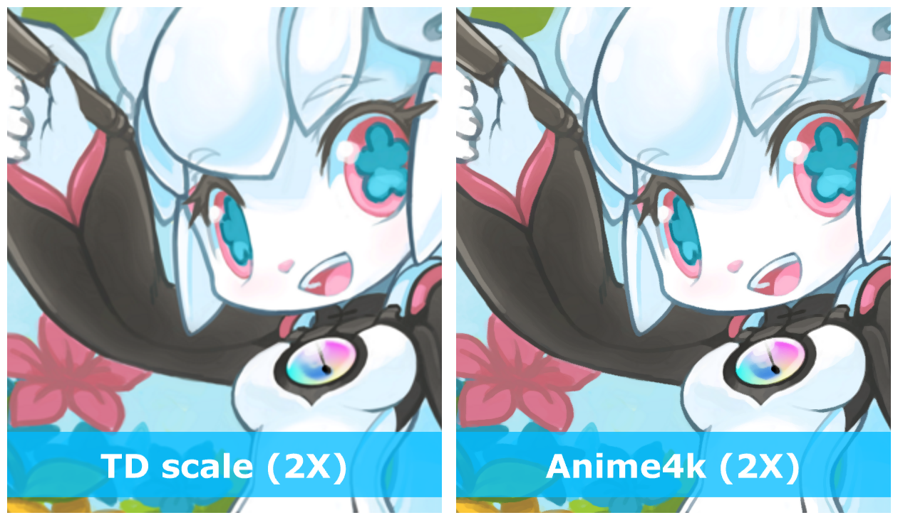
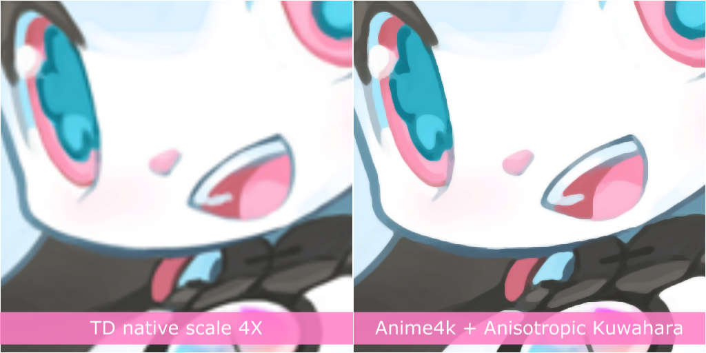
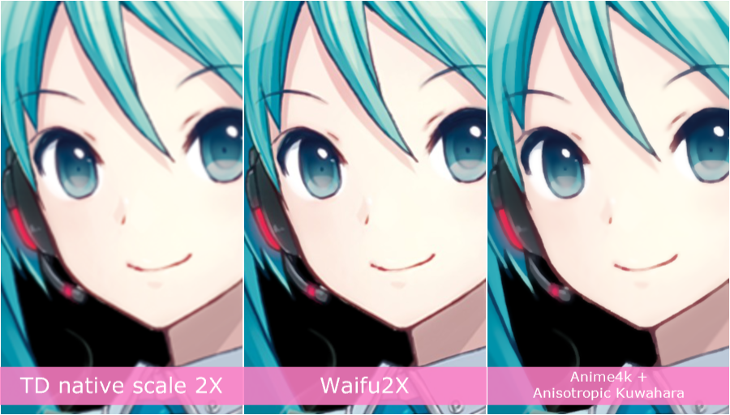

TD-Anime4K
===

[Anime4K](https://github.com/bloc97/Anime4K) is an upscaler specifically for anime style. This repository is an implementation of Anime4K in [TouchDesigner](http://www.derivative.ca/) that can be used to upscale low resolution textures to higher textures.

( source : [Kiki](https://krita.org/en/about/kiki/) / [Krita](https://krita.org/) / by [Tyson Tan](https://www.deviantart.com/tysontan) )

( source : Lain Iwakura / [serial experiments lain](https://en.wikipedia.org/wiki/Serial_Experiments_Lain) / [Lain TTL](https://www.nbcuni.co.jp/rondorobe/anime/lain/ttl/) )

## Integrate with other filters

## Anime4K v1.0 RC
Reduced texture loss, aliasing and banding in Anime4K v1.0 RC.

---
Author : Yea Chen <yeataro@gmail.com> \
Source GLSL code : [Anime4K](https://github.com/bloc97/Anime4K) by [bloc97](https://github.com/bloc97)@GitHub \
License : [MIT license](https://github.com/yeataro/TD-Anime4K/blob/master/LICENSE)